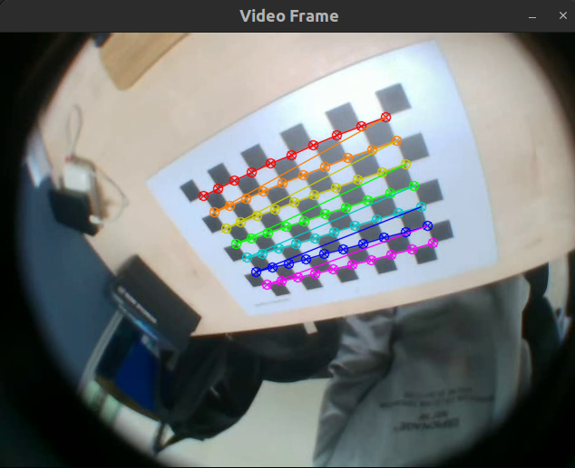
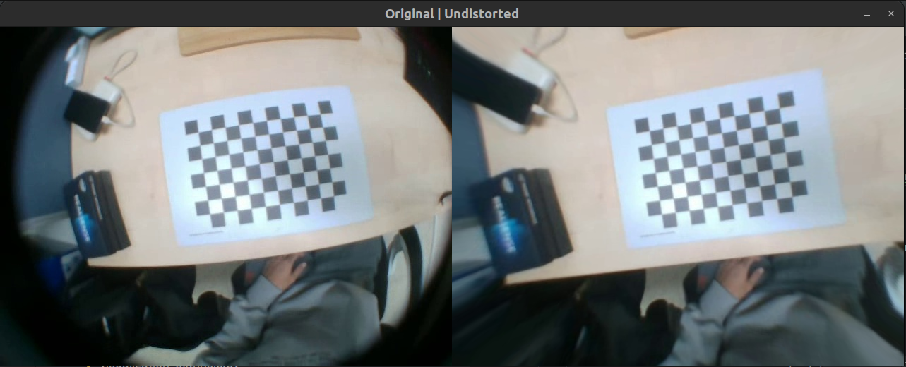
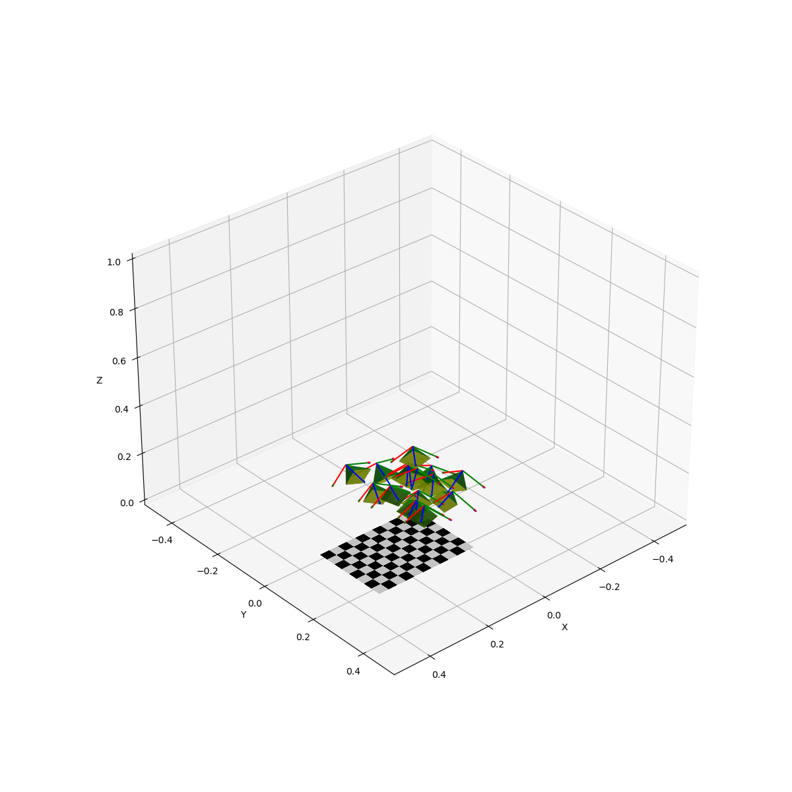

# hdw_camera_calibration

- 카메라 캘리브레이션을 위한 레포지토리
- 예제 비디오는 Intel Realsense D435i에 fisheye 렌즈를 장착한 상태로 촬영하였습니다.

## Results example
- 체커보드 패턴 검출 결과
    
- 결과 출력
    
    
- 카메라 포즈 시각화
    

## Dependencies
- OpenCV 4.5.5
    ```bash
    $ cd ./hdw_camera_calibration/thirdparty/OpenCV
    $ git clone -b 4.5.5 https://github.com/opencv/opencv.git
    $ mkdir build install && cd build
    $ cmake -DCMAKE_BUILD_TYPE=Release -DCMAKE_INSTALL_PREFIX=../install ../opencv
    $ make -j$(nproc)
    $ make install
    ```
- yaml-cpp
    ```bash
    $ sudo apt update && sudo apt install libyaml-cpp-dev
    ```
- NumPy, Matplotlib, pyyaml
    ```bash
    $ pip install numpy matplotlib pyyaml
    ```

## Usage
1. 비디오 이용
    ```bash
    ./Camera_Calibration -w 10 -h 7 -s 0.022 -i ./data/videos/checkerboard.mp4 -t video -o camera_params.yml --camera-width 640 --camera-height 480 --display-result 
    ```
    - `Spacebar`를 누르면, 체커보드 패턴 검출 후, `Enter`를 누르면 캘리브레이션 이미지로 저장
    - `ESC`를 누르면 프로그램 종료
    - `--display-result` 옵션을 사용하면, 왜곡 보정 전후의 이미지를 보여줍니다.
2. 이미지 이용
    ```bash
    ./Camera_Calibration -w 10 -h 7 -s 0.022 -i ./data/images -t image -o camera_params.yml --camera-width 640 --camera-height 480 --display-result
    ```
3. 웹캠 이용 (TODO)
    ```bash
    ./Camera_Calibration -w 10 -h 7 -s 0.022 -i 0 -t webcam -o camera_params.yml --camera-width 640 --camera-height 480 --display-result
    ```
4. 카메라 포즈 시각화
    ```bash
    python3 ./visualize_camera_pose.py
    ```

## TODO
- [ ] Kanala-Brandt 모델 적용
- [ ] Parsing 수정
- [ ] 웹캠을 이용한 캘리브레이션
- [ ] 코드 리팩토링 및 최적화
